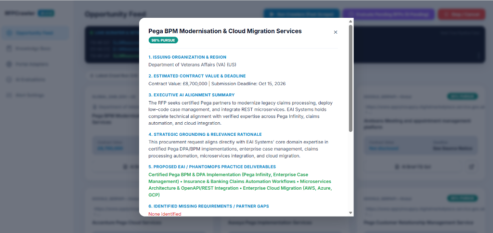

# RFP Intelligence & Automated Procurement System

> **Enterprise AI-powered procurement intelligence engine for real-time RFP scraping, stateful LangGraph multi-agent reasoning, deep PDF document parsing, and grounding evaluation tuned for EAI Systems (`eaisystems.com`) and PhantomOps (`phantomops.ae`).**

---

## 🖼️ Dashboard Overview & Interface Tour

### 1. Opportunity Feed & Real-Time Pipeline Stream
The main dashboard presents live procurement opportunities scraped across global portals and official JSON feeds, featuring real-time LLM reasoning event stream logs, PURSUE/REVIEW match tags, and fast scraping controls.


---

### 2. 12-Question Executive AI Brief Modal
Clicking **`📄 AI Brief (12 Qs)`** on any tender card opens an executive briefing dossier outlining issuing authority, estimated contract value, executive alignment summary, practice deliverables, and missing requirement gaps.



---

### 3. Company Grounding Knowledge Base
Grounding domain knowledge store indexed for **EAI Systems** (`eaisystems.com`) and **PhantomOps** (`phantomops.ae`) with 1-click domain vector re-sync capability.


---

### 4. Configured Portal Adapters
Multi-portal scraping control panel supporting UK Contracts Finder OCDS API, EU TED Search API, Find a Tender, SAM.gov, SerpApi, DuckDuckGo, and Craxy AI.


---

### 5. Deep AI Opportunity Evaluations
Dedicated analysis workspace with score filters (`PURSUE Only`, `Match Score >= 70%`), matched practice deliverables, missing gap tags, and 1-click re-evaluations.


---

## ⚡ Key Features

- **🌐 Multi-Portal & Keyless JSON API Ingestion**:
  - **UK Contracts Finder OCDS API (`UKContractsAPIAdapter`)** — Direct OCDS search endpoint ingestion filtered for IT Services (`72000000`) and Software Packages (`48000000`).
  - **EU TED Search API (`EUTEDAPIAdapter`)** — Keyless EU Tenders Electronic Daily API with dynamic 24-48h publication date range filtering (`PD=[{yesterday} TO {today}]`) and graceful HTTP 202 Async/Accepted handling.
  - **Find a Tender (UK)** — Enterprise-level UK high-value public procurement notices.
  - **SAM.gov (US Federal Solicitations)** — Federal solicitation dorking and dynamic parsing.
  - **Craxy AI & DuckDuckGo** — Multi-portal fallback scrapers for international tenders.
- **🤖 Stateful LangGraph Multi-Agent Architecture**:
  - **Domain Router Agent**: Classifies tender scope, returning explicit rejection for supplier profiles, DPS directories, expired notices, or non-IT construction.
  - **Expert Evaluator Agent**: Evaluates capability alignment against Pega BPM, EAI Integration, and Sovereign Arabic AI workforces.
  - **Brief Synthesizer Agent**: Generates structured 12-question executive briefing dossiers.
- **🧹 Pre-Routing Deduplication & Noise Suppression**:
  - Automatically checks SQLite database (`external_rfp_id`, `source_url`, `title+org`) and silently drops pre-existing records to keep console logs clean.
  - Pre-filtered IT CPV JSON API sources bypass Stage 1 keyword filters cleanly.
- **🔒 Concurrency Protection & Rate Limit Safety**:
  - Built-in `_crawl_lock_active` concurrency guard to prevent duplicate overlapping crawl triggers.
- **📄 Deep PDF Attachment Extraction**:
  - Automatically detects, downloads, and parses attached PDF specification documents using `pypdf`.
  - Injects visual **`📄 PDF`** badges onto dashboard cards with direct specification download links.
- **🧠 Dual AI Reasoning Engine**:
  - **Primary**: Groq API (`qwen/qwen3.8-27b`).
  - **Secondary**: Google Gemini API (`gemini-3.6-flash`).

---

## 🛠️ Tech Stack

| Component | Technology |
|---|---|
| **Backend Framework** | FastAPI (Python 3.10+) |
| **Agent Orchestration** | LangGraph & LangChain State Graph |
| **Database ORM** | SQLAlchemy with SQLite (`rfp_intelligence.db`) |
| **JSON APIs & Crawling** | `httpx` AsyncClient, BeautifulSoup4, OCDS API, EU TED API |
| **PDF Extraction** | `pypdf` (In-memory text extraction) |
| **AI LLM Engines** | Groq API (`qwen/qwen3.8-27b`), Google Gemini 3.6 Flash |
| **Alerts & Logging** | SMTP Email Alerts, In-Memory System Event Logger |
| **Frontend UI** | Modern Vanilla CSS, Responsive Glassmorphic Dashboard |

---

## ⚙️ Quick Start Guide

### 1. Clone the Repository
```bash
git clone https://github.com/DeveshEAI/RFPCrawler.git
cd RFPCrawler
```

### 2. Set Up Virtual Environment & Dependencies
```bash
python -m venv venv
.\venv\Scripts\Activate.ps1
pip install -r requirements.txt
```

### 3. Environment Configuration (`.env`)
Create or edit the `.env` file in the root directory:

```ini
APP_NAME="RFP Intelligence System"
VERSION="1.0.0"
DATABASE_URL="sqlite:///./rfp_intelligence.db"

# Primary LLM Configuration (groq or gemini)
LLM_PROVIDER="groq"
GROQ_API_KEY="gsk_your_groq_api_key_here"
GROQ_MODEL="qwen/qwen3.8-27b"

# Backup LLM Configuration
GEMINI_API_KEY="your_gemini_api_key_here"
GEMINI_MODEL="gemini-3.6-flash"

# Search Dorking
SERPAPI_KEY="your_serpapi_key_here"

# Alerts
ALERT_EMAIL_TO="rfp-alerts@eaisystems.com"
MATCH_SCORE_THRESHOLD=70
HIGH_PRIORITY_SCORE=85
```

### 4. Run the Application
```bash
python main.py
```
Open your browser and navigate to: **`http://localhost:8000`**

---

## 📁 Repository Architecture

```
RFPCrawler/
├── main.py                          # Application entry point
├── config.py                        # Pydantic environment configuration
├── requirements.txt                 # Dependencies
├── .env                             # Active environment credentials
├── docs/
│   └── images/                      # Dashboard UI screenshots & diagrams
├── src/
│   ├── api/
│   │   └── server.py                # FastAPI dashboard routes & endpoints
│   ├── db/
│   │   ├── database.py              # SQLite session & engine setup
│   │   └── models.py                # Database models (RFPOpportunity, RFPExecutionEvaluation)
│   ├── intelligence/
│   │   ├── graph_state.py           # LangGraph RFPState TypedDict schema
│   │   ├── agents.py                # Specialized Agent Nodes (Router, Evaluator, Synthesizer)
│   │   ├── llm_reasoner.py          # LLMOpportunityReasoner & LangGraph App
│   │   ├── pipeline.py              # Crawl, Stage 1 Filter, and Batch AI Evaluation pipeline
│   │   └── stage1_filter.py         # Deterministic anti-noise filter
│   ├── services/
│   │   ├── logger_service.py        # System event logger
│   │   └── email_service.py         # Email notification alerts
│   └── sources/
│       ├── base_adapter.py          # Base portal adapter & PDF extraction utilities
│       ├── base_json_adapter.py     # Base JSON API adapter (httpx AsyncClient)
│       ├── uk_contracts_api_adapter.py # UK Contracts Finder OCDS Search API adapter
│       ├── eu_ted_api_adapter.py    # EU TED Search API adapter (Dynamic 24-48h date query)
│       ├── contracts_finder_adapter.py  # UK Contracts Finder scraper
│       ├── find_a_tender_adapter.py     # UK Find a Tender scraper
│       ├── global_tech_tenders_adapter.py # SAM.gov SerpApi dorking scraper
│       ├── craxy_ai_adapter.py      # Craxy AI scraper
│       └── duckduckgo_free_adapter.py # DuckDuckGo fallback scraper
```

---

## 🌐 Grounding Capabilities

| Domain | Corporate Focus | Core Capabilities |
|---|---|---|
| **`eaisystems.com`** | Enterprise Integration & Low-Code | Certified Pega BPM & DPA, Enterprise Case Management, Cloud Migration (AWS/Azure/GCP), Banking & Insurance Workflows |
| **`phantomops.ae`** | Sovereign Agentic AI | Sovereign Arabic-Native AI Agents, BFSI/Government KYC & Compliance, Air-Gapped/Private Cloud Deployments |

---

## 📜 License

Distributed under the **MIT License**. Built for **EAI Systems** & **PhantomOps**.

